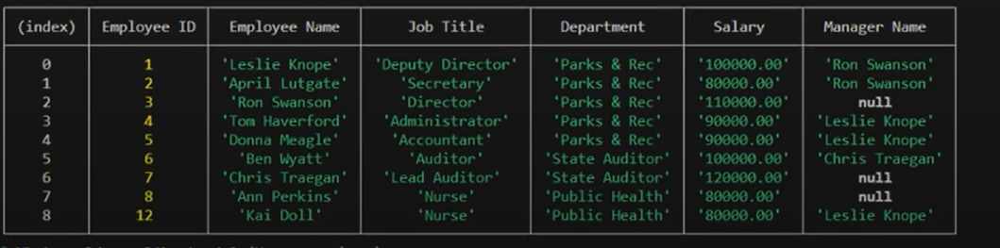

# Employee Tracker
  '

  ## Description

 To create a **content management systems (CMS)** interfaces that allow non-developers to easily view and interact with information stored in databases.

  ## Table of Content 
- [Employee Tracker](#employee-tracker)
  - [Description](#description)
  - [Table of Content](#table-of-content)
  - [Installation](#installation)
  - [Usage](#usage)
  - [License](#license)
  - [Links](#links)
  - [Github](#github)
  
## Installation
Node js
Inquirer
Mysql

## Usage 
To build a command-line application from scratch using Node js, Inquirer, & MySql to manage a company's employee database. Here are the examples. 

## License
  
Read about your license MIT

 ## Links 
Deployed page: https://kaidoll.github.io/EmployeeTracker/
Walkthrough video: https://drive.google.com/file/d/1Y87OlBbtwojxbMfyKDCyTaw5zvlL0foj/view?usp=sharing  

 ## Github 
Username: KaiDoll